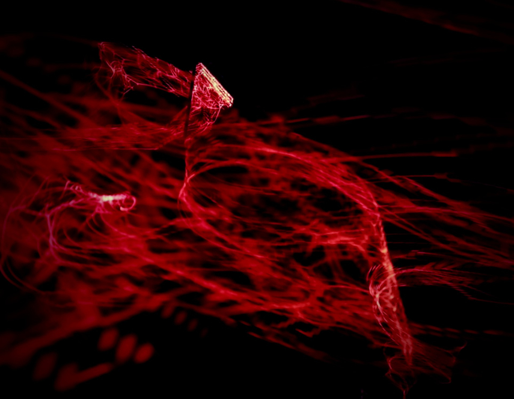

 
### Todo

- [ ] implement down-up scaling
  - [ ] half size input image
  - [ ] scale up to use 4 times the amount of physical pixels per original image pixel (more light at the cost of reduced quality)
  - [ ] 800 at 4px -> 400  

- [ ] multi select countdown config: none, audio, visual, both
- [ ] visual countdown
- [ ] audio countdown
- [ ] start sound
- [ ] end sound